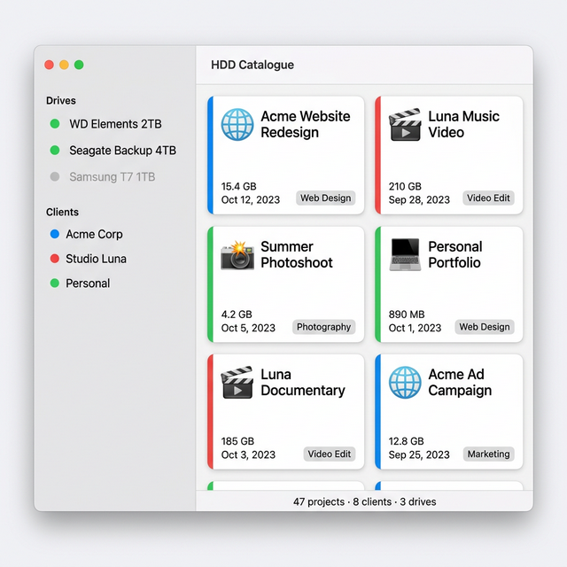
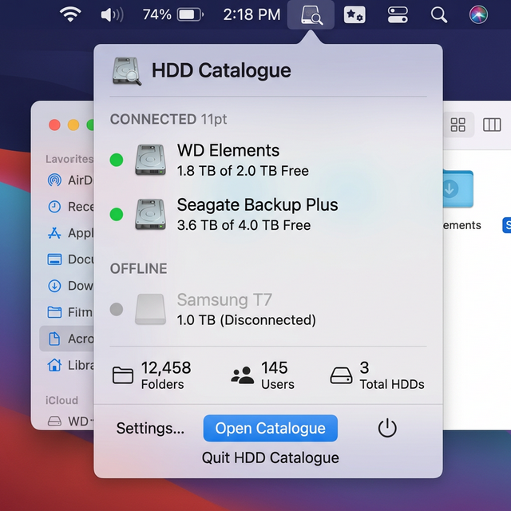
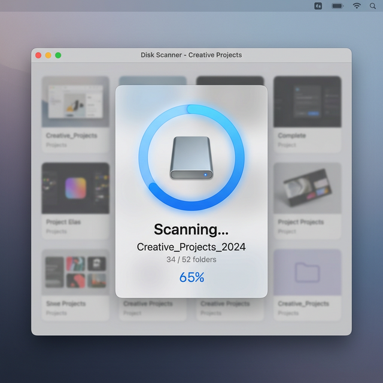
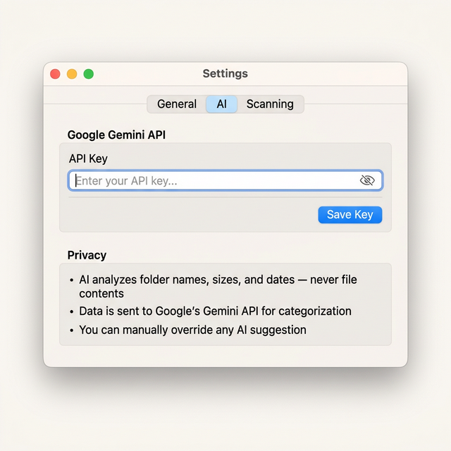
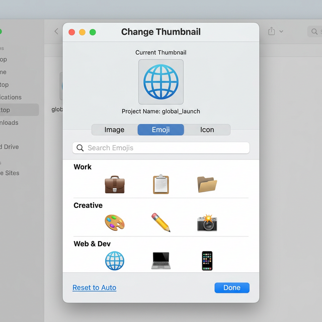
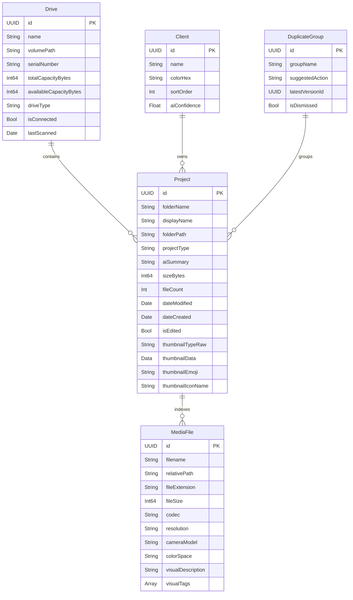

<p align="center">
  
</p>

<h1 align="center">HDD Catalogue</h1>

<p align="center">
  <strong>A macOS menu-bar app that automatically indexes your external drives and uses AI to categorize projects, detect duplicates, and keep everything searchable — even when drives are offline.</strong>
</p>

<p align="center">
  
  
  
  
  
  <a href="https://github.com/timon2200/hdd-catalogue/releases/latest"></a>
</p>

---

## 🎯 The Problem

Creative professionals accumulate dozens of external hard drives with thousands of project folders. Finding "that one project from 2022" means plugging in drives one by one and digging through cryptic folder names like `AcmeCorp_WebsiteV3_FINAL_Final2`. When drives aren't plugged in, the data is invisible.

## ✨ The Solution

**HDD Catalogue** lives in your menu bar and automatically scans every external drive you plug in. It uses Google Gemini AI to understand your projects — identifying clients, categorizing work types, detecting duplicates across drives — and keeps everything searchable even when drives are disconnected.

---

## 📸 Screenshots

### Main Catalogue View

Browse all your indexed projects in a rich grid with client color coding, type badges, emoji thumbnails, and AI-generated summaries. Switch between grid and list views.

<p align="center">
  
</p>

### Menu Bar Dropdown

Always accessible from your menu bar. See connected and offline drives at a glance, quick stats, and one-click access to the full catalogue.

<p align="center">
  
</p>

### Live Scan Progress

When a drive is mounted, scanning begins automatically with an animated progress ring showing the current folder and completion percentage.

<p align="center">
  
</p>

### AI Settings & Privacy

Securely store your Gemini API key in the macOS Keychain. The app only sends folder names, sizes, and dates to the AI — never file contents.

<p align="center">
  
</p>

### Custom Thumbnails

Personalize project cards with custom images (drag & drop), emoji, or SF Symbols. Three-tab picker with search and categorized browsing.

<p align="center">
  
</p>

---

## 🏗️ Architecture

```
HDD Catalogue/
├── HDD_CatalogueApp.swift          # App entry — MenuBarExtra + Window + Settings
├── Models/
│   ├── Drive.swift                  # External drive metadata (@Model)
│   ├── Project.swift                # Catalogued project folder (@Model)
│   ├── Client.swift                 # AI-detected or manual client (@Model)
│   ├── MediaFile.swift              # Deep-indexed file metadata (@Model)
│   ├── DuplicateGroup.swift         # Cross-drive duplicate groups (@Model)
│   └── ColorPalette.swift           # 20 curated client colors
├── Services/
│   ├── DriveMonitor.swift           # NSWorkspace mount/unmount listener
│   ├── ScanEngine.swift             # Async folder enumeration + deep file indexing
│   ├── GeminiService.swift          # Gemini 2.0 Flash API integration
│   ├── QwenService.swift            # Local Qwen AI for camera/color detection
│   ├── KeychainHelper.swift         # Secure API key storage
│   └── ThumbnailManager.swift       # Image processing + emoji/SF Symbol data
└── Views/
    ├── ContentView.swift            # NavigationSplitView — sidebar + detail
    ├── MenuBarView.swift            # Menu bar dropdown UI
    ├── SidebarView.swift            # Drive list + client list + alerts
    ├── CatalogueGridView.swift      # Grid/list toggle + unified search results
    ├── ProjectCardView.swift        # Individual card with drag-drop thumbnail
    ├── ProjectFileExplorerView.swift # Full file explorer with info panel
    ├── ProjectEditView.swift        # Edit sheet — name, client, type, notes
    ├── ThumbnailPickerView.swift    # Three-tab thumbnail picker
    ├── DuplicateResolutionView.swift # Side-by-side duplicate comparison
    ├── ScanProgressView.swift       # Animated scanning overlay
    ├── StorageDashboardView.swift   # Storage intelligence dashboard
    ├── ArchiveSuggestionsView.swift  # AI-powered archive recommendations
    ├── DriveComparisonView.swift    # Side-by-side drive comparison
    ├── FileTypeSearchView.swift     # Cross-drive file type search
    ├── TagColorHelper.swift         # Shared tag color utilities
    ├── TagInputView.swift           # Tag input with autocomplete
    └── SettingsView.swift           # General / AI / Scanning tabs
```

---

## ⚡ Features

### Core
- **Menu Bar Agent** — Lives in the menu bar (`LSUIElement`), always accessible without cluttering the Dock
- **Auto-Scan on Mount** — Detects drive connections via `NSWorkspace` notifications and scans immediately
- **Deep File Indexing** — Indexes every media file with codec, resolution, frame rate, bitrate, duration, and camera metadata
- **Offline Catalogue** — All project and file metadata persists via SwiftData, searchable even when drives are disconnected
- **Shared ModelContainer** — Single SwiftData container shared across all scenes for consistent data

### Unified Search
- **Single Search Bar** — One search bar that works everywhere — catalogue view and file explorer
- **Project Search** — Search across project names, folder names, types, AI summaries, client names, drive names, tags, and notes
- **Clip/File Search** — Search individual files by filename, codec, camera model, color space, resolution, visual tags, and AI descriptions
- **Match Context** — Each file result shows WHY it matched (e.g., "AI Description: …bustling **market** scene…") with the query highlighted in cyan
- **Thumbnails in Results** — File search results show real video frame / image thumbnails, loaded sequentially
- **Click to Explore** — Clicking a file result opens the full file explorer navigated to that file with its info panel open

### File Explorer
- **Three-Panel Layout** — Folder tree sidebar, file grid/list, and detail info panel
- **Rich Metadata Panel** — Shows file info, video specs (resolution, codec, frame rate, bitrate, bit depth), camera info (model, lens, log/gamma, color gamut), and audio track details
- **Video Scrubbing** — Hover over video thumbnails to scrub through frames
- **Sequential Thumbnails** — Thumbnails load one-by-one via rate-limited actor queue to avoid overwhelming the system with large RAW folders

### AI-Powered
- **Project Categorization** (Gemini 2.0 Flash) — Identifies project type, client, and generates summaries from folder structure and metadata
- **Camera Auto-Detection** (Qwen 3.5) — Analyzes one clip per camera folder to detect camera model, color profile (S-Log3, D-Log M, etc.), and codec. Results apply to all files in that folder
- **Visual Tagging** (Qwen 3.5) — AI-generated visual tags and descriptions for each clip (e.g., "sunset", "interview", "aerial")
- **Duplicate Detection** — Finds the same project across multiple drives, identifies the latest version
- **Privacy-First** — Only folder names, sizes, and dates are sent to cloud AI. Visual analysis uses local Qwen model

### LOG → Rec.709 Color Conversion
- **One-Click Toggle** — Button to enable/disable LOG to Rec.709 color conversion in preview and scrubbing
- **Per-Camera LUTs** — Automatically selects the correct LUT based on detected camera profile (S-Log3, D-Log M, etc.)
- **Real-Time Preview** — CoreImage-based LUT application for instant visual feedback

### Storage Intelligence
- **Storage Dashboard** — Total storage across all drives, per-client breakdown (pie/bar chart), SSD vs HDD usage, growth trends, and "most free space" quick answer
- **Archive Suggestions** — AI-powered recommendations for projects that could be archived based on age, deliverables, and activity status, with space savings report
- **Drive Comparison** — Side-by-side view of two drives highlighting shared projects (backups) and unique projects (not backed up)
- **File Type Search** — Cross-drive search for specific file types (`.prproj`, `.r3d`, `.mogrt`, etc.) with results grouped by drive

### UI
- **Grid + List Views** — Toggle between visual card grid and compact list
- **Client Color System** — 20 curated colors auto-assigned to clients, visible as accent strips on cards and dots in the sidebar
- **Custom Thumbnails** — Drag-drop images, pick from categorized emoji, or choose SF Symbols
- **Project Editing** — Override any AI suggestion; edited projects are protected from future AI overwrites (`isEdited` flag)
- **Duplicate Resolution** — Side-by-side comparison with latest-version badges, dismiss/resolve actions
- **Animated Scan Progress** — Circular progress ring with pulse animation, per-folder updates, and percentage display
- **Smart Bins** — Auto-filtered project groups (e.g., "Recent", "Large Projects", "Needs Review")
- **Dashboard View** — Stats header with project counts, total size, and camera distribution
- **Premium Hover Effects** — Spring-physics scale + shadow lift animations on project cards
- **Gradient Capacity Bars** — Color shifts green → yellow → orange → red based on drive usage
- **Favorites / Pinning** — Pin projects to always appear at the top; toggle via context menu
- **Sort Controls** — Sort by date, name, size, client, status, or completeness with asc/desc toggle

### Security
- **Keychain Storage** — API key stored securely in macOS Keychain via `Security.framework`
- **No Sandbox Restriction** — Runs without sandbox to access external volume paths directly

---

## 📥 Download & Install

1. **[Download the latest release](https://github.com/timon2200/hdd-catalogue/releases/latest)** — grab `HDD Catalogue.zip`
2. Unzip and drag **HDD Catalogue.app** into your Applications folder
3. Launch — the app lives in your **menu bar** (look for the drive icon)

> **Auto-updates included.** Once installed, the app checks for new versions automatically via [Sparkle](https://sparkle-project.org). You'll get a prompt whenever a new version is available — one click to update, no reinstall needed.

### Configure AI (Optional)

1. Open the app (click the drive icon in the menu bar)
2. Go to **Settings → AI** tab
3. Install [Ollama](https://ollama.com) and pull the AI models:
   ```bash
   ollama pull qwen3.5:0.8b   # vision (fast)
   ollama pull qwen3.5:4b     # reasoning (smart)
   ```
4. The app uses 100% local AI — **no data leaves your Mac**

### Build from Source

```bash
git clone https://github.com/timon2200/hdd-catalogue.git
cd hdd-catalogue
open "HDD Catalogue.xcodeproj"
# Build and Run (⌘R)
```

Requires **macOS 14.0+** and **Xcode 15.0+**.

---

## 🔧 Tech Stack

| Component | Technology |
|---|---|
| **Language** | Swift 5.9+ |
| **UI Framework** | SwiftUI |
| **Data Persistence** | SwiftData (`@Model`, `@Query`, `ModelContainer`) |
| **Cloud AI** | Google Gemini 2.0 Flash (REST API) |
| **Local AI** | Qwen 3.5 0.8B / 4B via Ollama (camera detection, visual tagging) |
| **Color Science** | CoreImage + .cube/.3dl LUT application |
| **Media Analysis** | AVFoundation (`AVAssetImageGenerator`, `AVAssetTrack`) |
| **Security** | macOS Keychain (`Security.framework`) |
| **Drive Detection** | `NSWorkspace` mount/unmount notifications |
| **Concurrency** | Swift Concurrency (`async/await`, `@MainActor`, Actors) |
| **Architecture** | `@Observable` services, `@Query`-driven views |

---

## 📐 Data Model



---

## 🛣️ Roadmap

See [ROADMAP.md](ROADMAP.md) for the full feature roadmap with phases.

### Recently Completed
- [x] Over-the-air updates via Sparkle + GitHub Releases
- [x] Storage Dashboard with per-client breakdown, SSD/HDD tracking, growth trends
- [x] AI-powered Archive Suggestions with space savings report
- [x] Drive Comparison View (side-by-side backup verification)
- [x] File Type Search across all drives
- [x] Favorites / Pinning with sort controls
- [x] Premium hover animations and gradient capacity bars

### Up Next
- [ ] App icon design
- [ ] IOKit-based drive serial number and type detection
- [ ] Accessibility / VoiceOver labels
- [ ] Unit and UI tests

---

## 📄 License

This project is licensed under the MIT License. See the [LICENSE](LICENSE) file for details.

---

<p align="center">
  Built with ❤️ using SwiftUI, SwiftData, and Google Gemini
</p>
